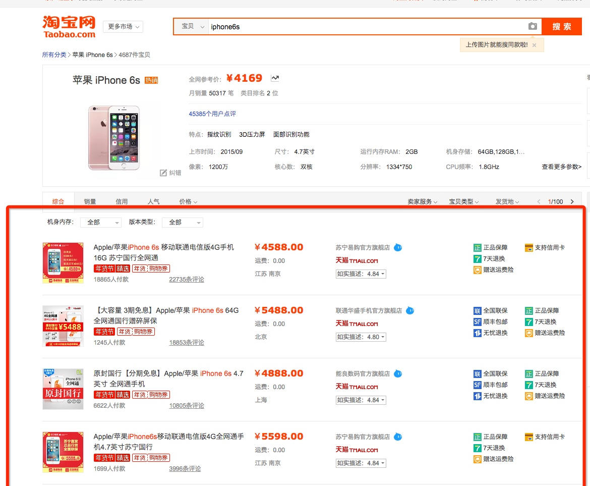
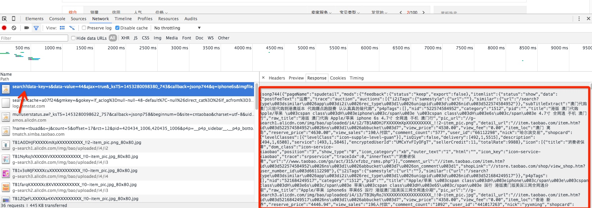
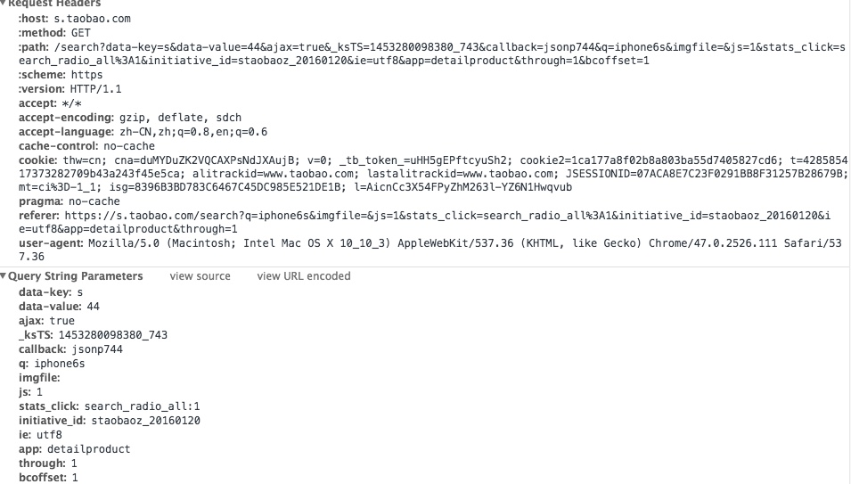
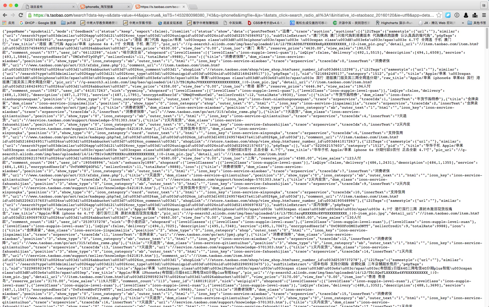

<!--
  author:donar
  head:http://www.easyicon.net/api/resizeApi.php?id=556429&size=128
  date:2016-06-10
  title:爬淘宝排名数据
  tags:爬虫
  category:技术笔记
  status:publish
  summary:用多种技术避免了被淘宝ban的情况
-->

起
=

最近公司需求，要爬淘宝的宝贝排名数据



爬下来的数据要入库 每天要抓50w个关键词 每个关键词爬500条 算下来每天就是2.5亿条数据 然后每天这2.5亿条数据都要提供查询

承
=

首先我们要做所有准备工作

用什么爬？ 

本人习惯java python略懂 ，但是这里为了集成到 java 项目中所以就直接上java了 用的是 httpclient（以前都习惯用原生的jdk中的工具去抓，主要是要抓的页面是https的 毕竟httpclient 的便利性还是挺诱人）

```java
//创建
HttpClientBuilder httpClientBuilder = HttpClientBuilder.create();
CloseableHttpClient closeableHttpClient = httpClientBuilder.build();
System.out.println(url);
logger.info(url);
//构建请求
HttpGet httpGet = new HttpGet(url);
httpGet.addHeader("Accept", "text/html,application/xhtml+xml,application/xml;q=0.9,image/webp,*/*;q=0.8");
httpGet.addHeader("Accept-Encoding", "gzip, deflate, sdch");
httpGet.addHeader("Accept-Language", "zh-CN,zh;q=0.8,en;q=0.6");
httpGet.addHeader("Cookie", MyServer.cookie);
httpGet.addHeader("Referer", "https://s.taobao.com/search?q=" + keyword + "&imgfile=&commend=all&ssid=s5-e&search_type=item&sourceId=tb.index&spm=a21bo.7724922.8452-taobao-item.1&ie=utf8&initiative_id=tbindexz_20160118");

......

//抓取
HttpResponse httpResponse = closeableHttpClient.execute(httpGet);
//替换cookie
Header header = httpResponse.getFirstHeader("set-cookie");
if (header == null) header = httpResponse.getFirstHeader("Set-Cookie");
if (header != null) cookie2 = "; " + header.getValue();
HttpEntity entity = httpResponse.getEntity();
//读流中的内容
String content = EntityUtils.toString(entity);
```

至于请求头怎么构建后面在讨论


爬哪个页面？

打开chrome开发者工具 遍历一遍网络请求后发现我们要抓的数据在这个url里



居然还是个json字符串 这样我们就解析数据就方便了很多 jsoup 什么的貌似就不需要了 直接用fastjson解析这个json串即可

 

请求参数和cookie还是有点复杂的 我们也放在稍后讨论

被ban怎么办？

由于s.taobao.com这种的防爬规则很严格，所以我们要考虑到我们的数据爬取的机器被淘宝ban掉了要怎么处理，很直观的想法被ban掉了就换ip （目前国内还是有些『黑户』可以搞到些ADSL的机器），换请求头，这样肯定是可以解决的，但是这样做满足不了我们爬去速度的需求，这个也稍后讨论。

数据怎么存？

每天2.5亿条数据要怎么存其实也是个很头疼的问题 ，当然solr 什么的暂时没做考虑 ，就是想存mysql，不说分库分表操作肯定是少不了的 （数据会定时清理掉只保存最近几天的数据提供查询）。查的话也肯定要找到合适的索引才行


转
=

讲了这么多没用的，现在直切我们的主题

```java
String url = "https://s.taobao.com/search?data-key=s&data-value=" + start + "&ajax=true&q=" + keyword + "&imgfile=&ie=utf8&app=" + app + "&s=" + end + "&stats_click=search_radio_all:1&initiative_id=staobaoz_20160118&bcoffset=1&ntoffset=1";
```

这个就是我请求的url 首先解释一下各个参数 

q 对应的是要爬的关键词 如果有空格就讲空格替换为+号 

app 是指定查询所用的引擎 主要有三个 mainSrp vproduct detailproduct

data-value 是查询的开始的index 

s 是查询终止的index

另外淘宝第一页数据是48条 而后每页数据都是44条

如

data-value=44

s =88 

查询到的就是第二页的数据

另外发现了一个好东西 如果你在请求参数中加上ajax=true 同时去掉callback参数 那么你得到的数据就直接是一个可以被正确解析的json串 完全不需要额外的处理



就这样拼接url后就能直接抓到数据了 

但是当你访问几次后 淘宝警察就把你逮捕了（sec.taobao.com）因为你缺少一些必要的请求头信息

笔者至今回忆起与淘宝斗争的日子任然是一把辛酸。。。

首先我们不考虑淘宝是怎么反爬的，就思考如果要你反爬虫你会怎么做

我们可能会想到

1 记录ip 当请求的ip过于频繁我们就ban了这个ip

2 校验 cookie 如果不正确就不给数据 然并卵

3
